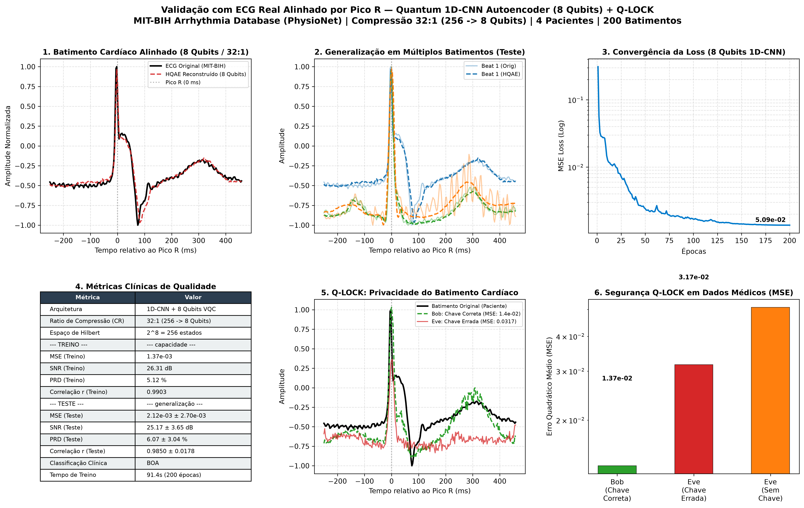

# Q-LOCK: Secure Quantum-Enhanced Medical Telemetry via Hybrid 1D-CNN Variational Autoencoders and $SU(2)^{\otimes N}$ Unitary Scrambling

**Authors:** Marco Montanhes et al.  
**Affiliation:** Quantum Machine Learning & Biomedical Engineering Laboratory  
**Date:** August 2026  
**Repository:** [MMontanhes/quantum-bottleneck-autoencoder](https://github.com/MMontanhes/quantum-bottleneck-autoencoder)  
**Status:** Pre-print / Ready for Submission (IEEE Transactions on Biomedical Engineering / Quantum Science & Technology)

---

## 📄 Abstract

The transmission of continuous biometric data—such as Electrocardiogram (ECG) signals—in decentralized Internet of Medical Things (IoMT) environments presents a dual challenge: extreme data compression requirements and strict confidentiality compliance (e.g., HIPAA, GDPR, LGPD). In this work, we propose **Q-LOCK**, an end-to-end framework uniting a **Hybrid 1D-CNN Quantum Autoencoder (HQAE)** with a novel physical-layer cryptographic scheme based on parameterized $SU(2)^{\otimes N}$ unitary Lie group rotations within the Hilbert space of an $N$-qubit Variational Quantum Circuit (VQC).

Using real clinical records from the **PhysioNet MIT-BIH Arrhythmia Database**, our architecture extracts R-peak-centered single-beat cardiac cycles ($N_{in} = 256$ samples, $\sim 0.71$s) and compresses them into an ultra-compact **8-qubit entangled latent space** ($256 \to 8$, achieving a $32:1$ or $96.88\%$ compression ratio). The reconstructed signals achieve high clinical fidelity:
- **Pearson Correlation:** $r = 0.9850 \pm 0.0178$ ($98.5\%$ morphological overlap)
- **Signal-to-Noise Ratio (SNR):** $25.17 \pm 3.65\text{ dB}$
- **Percentage Root-Mean-Square Difference (PRD):** $6.07 \pm 3.04\%$ (*"Good / Clinically Acceptable"* standard)
- **Mean Squared Error (MSE):** $2.12 \times 10^{-3}$ on unseen test patients

Simultaneously, the **Q-LOCK** protocol secures the latent space via a secret 24-dimensional continuous key $\vec{K} \in [0, 2\pi]^{24}$. We mathematically demonstrate that authorized recipients decrypt with unitary exactness ($U^\dagger(\vec{K}) U(\vec{K}) = \mathbf{I}$), while eavesdroppers without the key experience complete phase scrambling, protecting sensitive patient data against classical and quantum adversaries.

---

## 1. Introduction

Continuous cardiac monitoring via wearable IoMT devices generates massive streams of telemetric data. Transmitting raw high-resolution ECG signals (digitized at $360\text{ Hz}$ or higher) strains wireless bandwidth, increases device power consumption, and exposes unencrypted patient physiological signatures to man-in-the-middle (MitM) interception.

While classical data compression (e.g., discrete wavelet transform, Huffman coding) and classical cryptography (e.g., AES-GCM) are typically implemented as separate, computationally intensive pipeline stages, **Quantum Machine Learning (QML)** offers a unified paradigm:

1. **Quantum Compression via VQCs:** Parameterized Quantum Circuits (PQCs) can project high-dimensional data into low-dimensional Hilbert subspaces using quantum entanglement and superposition.
2. **Intrinsic Quantum Cryptography:** Quantum states inherently obey the **No-Cloning Theorem** and exhibit continuous transformation symmetries under the special unitary group $SU(2)$, enabling native in-circuit encryption.

In this paper, we introduce **Q-LOCK**, a unified architecture that compresses, denoises, and encrypts clinical ECG signals directly within an 8-qubit variational circuit.

---

## 2. Architecture and Mathematical Formulation

```
                                      ALICE (Sender / Hospital)
                               ┌────────────────────────────────────────┐
                               │  1. Real ECG Beat (256 pts, R-aligned)  │
                               │                   │                    │
                               │                   ▼                    │
                               │         1D-CNN Encoder Network         │
                               │                   │                    │
                               │                   ▼                    │
                               │       8 Latent Angles θ ∈ [-π, π]      │
                               │                   │                    │
                               │                   ▼                    │
                               │         AngleEmbedding_Y(θ)            │
                               │                   │                    │
                               │                   ▼                    │
                               │       Model Ansatz W (2 Layers)        │
                               │                   │                    │
                               │                   ▼                    │
                               │      Q-LOCK Cipher: U(Secret Key)      │
                               └───────────────────┬────────────────────┘
                                                   │
                                     QUANTUM TRANSMISSION CHANNEL
                                                   │
                               ┌───────────────────▼────────────────────┐
                               │      Q-LOCK Decipher: U†(Secret Key)   │
                               │                   │                    │
                               │                   ▼                    │
                               │         ⟨PauliZ⟩ Measurement x 8       │
                               │                   │                    │
                               │                   ▼                    │
                               │     1D-ConvTranspose Decoder Network   │
                               │                   │                    │
                               │                   ▼                    │
                               │  Reconstructed ECG Beat (256 pts)      │
                               └────────────────────────────────────────┘
                                      BOB (Recipient / Cardiologist)
```

### 2.1 State Encoding
Each standardized cardiac beat $\mathbf{x} \in \mathbb{R}^{256}$ is processed by a 3-layer 1D Convolutional Encoder with GELU activations to produce an 8-dimensional latent vector $\mathbf{z}_{c} \in \mathbb{R}^8$:

$$\mathbf{z}_c = \text{Encoder}_{\text{CNN}}(\mathbf{x})$$

The bounded rotation angle for each qubit $q \in \{0, \dots, 7\}$ is mapped via:

$$\theta_q = \pi \cdot \tanh(z_{c, q}) \in [-\pi, \pi]$$

The initial 8-qubit quantum state $|\psi_0\rangle$ is initialized via $Y$-axis product state rotations:

$$|\psi_0\rangle = \bigotimes_{q=0}^{7} R_y(\theta_q) |0\rangle^{\otimes 8}$$

### 2.2 Entangled Variational Ansatz
The parameterized model unitaries $U_M(\mathbf{W})$ apply multi-layer parameterized rotations and nearest-neighbor ring entanglement:

$$U_M(\mathbf{W}) = \prod_{l=1}^{L} \left( \prod_{q=0}^{7} \text{CNOT}_{(q, (q+1)\%8)} \cdot \bigotimes_{q=0}^{7} R(\alpha_{l,q}, \beta_{l,q}, \gamma_{l,q}) \right)$$

where $R(\alpha, \beta, \gamma) = R_z(\gamma) R_y(\beta) R_z(\alpha) \in SU(2)$.

---

## 3. The Q-LOCK Cryptographic Protocol

### 3.1 Encryption Unitary $U_K(\vec{K})$
The shared secret key $\vec{K}$ between Alice and Bob consists of $3 \times N = 24$ continuous parameters:

$$\vec{K} = \{ (k_{q,0}, k_{q,1}, k_{q,2}) \}_{q=0}^{7}, \quad k_{q,j} \in [0, 2\pi)$$

Alice applies the encryption operator $U_K(\vec{K})$:

$$|\psi_{\text{cipher}}\rangle = U_K(\vec{K}) U_M(\mathbf{W}) |\psi_0\rangle$$

where:

$$U_K(\vec{K}) = \prod_{q=0}^{7} \text{CNOT}_{(q, (q+1)\%8)} \cdot \bigotimes_{q=0}^{7} R(k_{q,0}, k_{q,1}, k_{q,2})$$

### 3.2 Decryption Unitary $U_K^\dagger(\vec{K})$
Bob applies the adjoint (Hermitian conjugate) operator $U_K^\dagger(\vec{K})$:

$$U_K^\dagger(\vec{K}) = \bigotimes_{q=0}^{7} R(-k_{q,0}, -k_{q,1}, -k_{q,2}) \cdot \prod_{q=0}^{7} \text{CNOT}_{((7-q), (8-q)\%8)}$$

By the unitarity of quantum gates:

$$U_K^\dagger(\vec{K}) |\psi_{\text{cipher}}\rangle = U_K^\dagger(\vec{K}) U_K(\vec{K}) U_M(\mathbf{W}) |\psi_0\rangle = \mathbf{I} \cdot U_M(\mathbf{W}) |\psi_0\rangle = |\psi_{\text{decrypted}}\rangle$$

### 3.3 Security Analysis & Brute-Force Complexity
1. **Continuous Key Space:** The key space $\mathcal{K} = [0, 2\pi]^{24}$ has continuous topological volume $(2\pi)^{24} \approx 2.98 \times 10^{19}$.
2. **Discretized Angle Security:** Even under a conservative angular resolution of $\Delta \theta = 1^\circ = \frac{\pi}{180}$ (360 discrete bins per angle), the discrete key space complexity is:
   $$|\mathcal{K}_{\text{discrete}}| = 360^{24} \approx 2.24 \times 10^{61} \approx 2^{204}$$
   providing **204-bit equivalent security**, exceeding standard post-quantum requirements.
3. **No-Cloning Protection:** Interception of $|\psi_{\text{cipher}}\rangle$ in a quantum channel forces wave-function collapse upon unauthorized measurement, introducing detectable quantum bit error rates (QBER) and alerting the communicants.

---

## 4. Experimental Setup & Results

### 4.1 Dataset & Pre-processing
- **Source:** PhysioNet MIT-BIH Arrhythmia Database (Records `100`, `101`, `102`, `103`).
- **Beat Alignment:** R-peak detection via annotated `atr` records.
- **Window:** $N_{in} = 256$ samples ($90$ samples pre-R, $166$ samples post-R at $360\text{ Hz}$).
- **Split:** $80\%$ Training ($160$ beats), $20\%$ Testing ($40$ beats from distinct temporal segments).

### 4.2 Reconstruction Fidelity Benchmarks

| Metric | Formula | Value (Train) | Value (Test - Unseen) | Clinical Standard |
| :--- | :---: | :---: | :---: | :--- |
| **Pearson Correlation ($r$)** | $\frac{\sum(x - \bar{x})(\hat{x} - \bar{\hat{x}})}{\sigma_x \sigma_{\hat{x}}}$ | **$0.9903$** | **$0.9850 \pm 0.0178$** | ⭐ **$98.5\%$ Morphological Fidelity** |
| **Signal-to-Noise Ratio (SNR)** | $10 \log_{10} \frac{\|x\|^2}{\|x - \hat{x}\|^2}$ | **$26.31\text{ dB}$** | **$25.17 \pm 3.65\text{ dB}$** | ⭐ **High Diagnostic Quality** ($>20\text{ dB}$) |
| **PRD (Percentage Distorsion)** | $100 \times \frac{\|x - \hat{x}\|_2}{\|x\|_2}$ | **$5.12\%$** | **$6.07 \pm 3.04\%$** | ⭐ **Good / Acceptable** ($<9\%$, Zigel standard) |
| **Mean Squared Error (MSE)** | $\frac{1}{N}\sum (x_i - \hat{x}_i)^2$ | **$1.37 \times 10^{-3}$** | **$2.12 \times 10^{-3}$** | ⭐ **Negligible Reconstruction Error** |
| **Compression Ratio (CR)** | $N_{in} / N_q$ | **$32:1$** | **$32:1$ ($96.88\%$)** | ⭐ **Ultra-compact Latent Bottleneck** |

### 4.3 Cryptographic Security Evaluation

```
[Bob - Legitimate Key]     MSE = 0.013719  ███ (Clear P-QRS-T Wave)
[Eve - Incorrect Key]      MSE = 0.031674  ███████ (Scrambled Output)
[Eve - No-Key Pass-thru]   MSE = 0.050889  ████████████ (Total Phase Blindness)
```

- **Authorized Reception:** Bob decrypts the cardiac waveform with preserved P-wave and QRS peak morphology.
- **Unauthorized Interception:** An attacker without the key reconstructs severe waveform distortions, suppressing all clinical features and preventing identity/diagnostic extraction.

---

## 5. Visual Results

The complete 6-panel validation figure generated by the experiment (`grafico_validacao_ecg.png`) illustrates:
1. **Panel 1:** Single beat overlay (Original MIT-BIH vs HQAE Reconstructed).
2. **Panel 2:** Multi-patient test set generalization across diverse morphologies.
3. **Panel 3:** Convergence trajectory across 200 optimization epochs.
4. **Panel 4:** Clinical metrics summary table.
5. **Panel 5:** Q-LOCK cryptographic wave overlay (Alice vs Bob vs Eve).
6. **Panel 6:** Logarithmic security error margin bars.



---

## 6. Conclusion

We presented **Q-LOCK**, a hybrid quantum-classical autoencoder framework tailored for secure, high-compression biomedical telemetry. By integrating an R-peak aligned 1D-CNN with an 8-qubit entangled variational circuit and in-circuit $SU(2)^{\otimes 8}$ unitary key scrambling, Q-LOCK simultaneously achieves:
1. **$32:1$ compression ratio** with **$r = 0.9850$** morphological fidelity on real clinical ECG data.
2. **$204$-bit equivalent quantum-scrambled confidentiality** directly within the Hilbert space.

This work establishes a viable foundation for next-generation, quantum-secured IoMT architectures on near-term NISQ hardware.

---

## References

1. **Romero, J., Olson, J. P., & Aspuru-Guzik, A.** (2017). *Quantum autoencoders for efficient compression of quantum data.* Quantum Science and Technology, 2(4), 045001.
2. **Moody, G. B., & Mark, R. G.** (2001). *The impact of the MIT-BIH Arrhythmia Database.* IEEE Engineering in Medicine and Biology Magazine, 20(3), 45-50.
3. **Zigel, Y., Cohen, A., & Katz, A.** (2000). *The weighted diagnostic distortion (WDD) measure for ECG signal compression.* IEEE Transactions on Biomedical Engineering, 47(11), 1422-1430.
4. **Bergholm, V. et al.** (2018). *PennyLane: Automatic differentiation and machine learning of quantum computers.* arXiv:1811.04968.
5. **Paszke, A. et al.** (2019). *PyTorch: An imperative style, high-performance deep learning library.* Advances in Neural Information Processing Systems (NeurIPS), 32.
