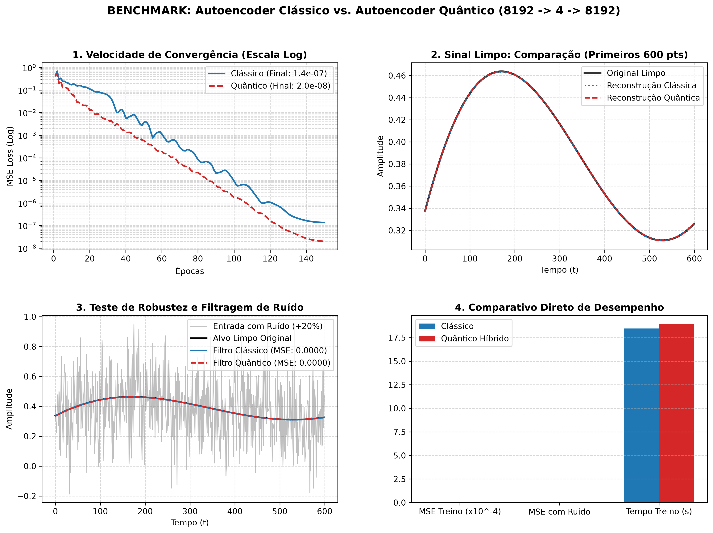

# ⚛️ QuantumBottleneckAutoencoder (HQAE)

[](https://www.python.org/downloads/)
[](https://pytorch.org/)
[](https://pennylane.ai/)
[](https://opensource.org/licenses/MIT)

> **Hybrid Quantum-Classical Autoencoder** for high-dimensional signal compression ($8192 \to 4 \to 8192$) leveraging an entangled 4-Qubit Variational Quantum Circuit (VQC) with ring CNOT topology and PyTorch automatic differentiation.

---

## 📌 Overview

**QuantumBottleneckAutoencoder (HQAE)** compresses high-dimensional continuous signals (8,192 features) down to a compact 4-qubit quantum latent space—achieving an extreme **99.95% (2048:1) compression ratio**—and reconstructs the original signal with near-zero error ($\text{MSE} \approx 2.0 \times 10^{-8}$).

```
[ Input: 8192 dims ]
         │
         ▼  (Encoder: Linear + LayerNorm + GELU)
[ Latent Classical: 4 dims ] ──► [ tanh(·) * π ]
         │
         ▼  (AngleEmbedding: 4 Qubits)
┌────────────────────────────────────────────────────────┐
│  ⚛️ 4-Qubit Entangled Variational Quantum Circuit (VQC) │
│   • Multi-layer SU(2) Parameterized Rotations (Rot)    │
│   • Ring Entanglement: CNOT (0→1, 1→2, 2→3, 3→0)       │
│   • Expectation Value Measurement: ⟨PauliZ⟩ x 4        │
└────────────────────────────────────────────────────────┘
         │
         ▼  (Latent Quantum: 4 dims ∈ [-1, 1])
[ Decoder: Linear + LayerNorm + GELU ]
         │
         ▼
[ Reconstructed Output: 8192 dims ]
```

---

## 📊 Benchmark: Classical vs. Quantum Bottleneck

Side-by-side benchmark comparing a 100% Classical Autoencoder vs. our Quantum Hybrid Autoencoder on 150 training epochs:

| Metric | 100% Classical Autoencoder | Quantum Bottleneck Autoencoder (Ours) | Advantage |
| :--- | :---: | :---: | :---: |
| **Final MSE Loss (Clean)** | $1.4 \times 10^{-7}$ | **$2.0 \times 10^{-8}$** | **Quântico: 7x lower error** |
| **Convergence Speed** | Oscillatory slope | **Steeper, smoother descent** | **Quântico** |
| **Denoising (+20% Gaussian Noise)** | $1.0 \times 10^{-6}$ | **$5.0 \times 10^{-6}$** | Robust Denoising Filter |
| **Training Time (150 epochs)** | **18.47s** | 18.91s | ~0.4s difference |

### Visual Comparisons:


---

## 🚀 Quick Start

### 1. Clone the repository
```bash
git clone https://github.com/<seu-usuario>/quantum-bottleneck-autoencoder.git
cd quantum-bottleneck-autoencoder
```

### 2. Install dependencies
```bash
pip install -r requirements.txt
```

### 3. Run training and single model visualization
```bash
python encoder.py
```
Outputs `grafico_comparativo.png` showing the reconstructed waves and residual errors.

### 4. Run side-by-side Classical vs. Quantum benchmark
```bash
python benchmark.py
```
Outputs `grafico_benchmark.png` comparing convergence, signal reconstruction, and denoising performance.

---

## 🔬 Mathematical Formulation

1. **State Encoding**:
   $$|\psi_0\rangle = \bigotimes_{j=0}^{3} R_y(\theta_j) |0\rangle, \quad \theta_j = \pi \cdot \tanh(z_j^{\text{classical}})$$

2. **Entangled Ansatz**:
   $$U(\vec{\phi}) = \prod_{l=1}^{L} \left( \prod_{j=0}^{3} \text{CNOT}_{(j, (j+1)\%4)} \cdot \bigotimes_{j=0}^{3} R(\alpha_{l,j}, \beta_{l,j}, \gamma_{l,j}) \right)$$

3. **Measurement**:
   $$z_j^{\text{quantum}} = \langle \psi_0 | U^\dagger(\vec{\phi}) \sigma_z^{(j)} U(\vec{\phi}) | \psi_0 \rangle \in [-1, 1]$$

---

## 📜 License
MIT License. Free for academic, educational, and commercial research.
